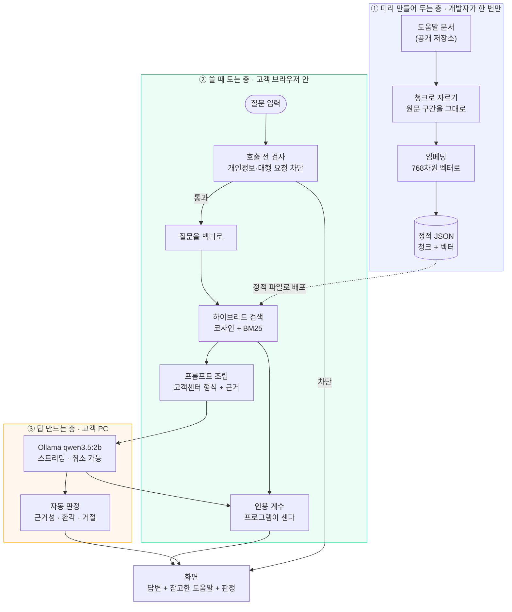

# 이미 있어 — 안내 챗봇 두 개

[이미 있어](https://already-got-it.vercel.app)(개인용 재고 관리 앱)의 공개 문서에 근거해 답하는 RAG 챗봇입니다. **읽는 사람이 다른 두 개**가 한 저장소에 있습니다.

| | [`support-bot/`](support-bot) — 고객센터 | [`dev-bot/`](dev-bot) — 개발자용 |
|---|---|---|
| **누가 쓰는가** | 앱을 쓰다 막힌 고객 | 챗봇을 검토하는 사람 |
| **근거 자료** | 고객용 도움말 7개 | 개발 문서 5개 (PRD·SQL·rules) |
| **답변 모양** | 결론 → 절차 → 주의 → 참고한 도움말 | 자유 서술 + `[AG-004]` 인용 |
| **화면** | 고객 모드 (검토 지표는 토글 뒤) | 유사도·판정 배지가 전면 |
| **인용 여부 판정** | **프로그램이 센다** | 판정 모델이 읽는다 |
| **상태** | ✅ 완성 (측정 225건 · 수용 기준 5/7) | ✅ 완성 (측정 108건) |
| **문서** | [PRD](support-bot/PRD.md) · [README](support-bot/README.md) · [회고](support-bot/docs/retro.md) | [PRD](dev-bot/PRD.md) · [README](dev-bot/README.md) · [회고](dev-bot/docs/retro.md) |

> **「완성」은 「기준을 다 넘겼다」가 아닙니다.** 만들기와 재기와 적기가 끝났다는 뜻입니다. `support-bot` 은 수용 기준 7개 중 둘(절차를 묻는 5문항 중 절차형 1개, 범위 밖 2문항 중 거절 1.3개)이 미달이고, **미달을 통과로 적지 않았습니다.** 원인은 [실패 정리](support-bot/docs/failures.md)에 단계별로 나눠 두었습니다 — 검색이 아니라 전부 생성 단계입니다.

> **왜 둘인가.** 먼저 만든 것이 개발자용이었습니다. 근거 자료가 `mark_wishlist_purchased` RPC 이름과 SQL 제약이 든 개발 문서였고, 답변 본문이 `[AG-004]` 같은 내부 ID 를 요구했습니다. 실제 고객은 출처를 열어도 읽을 수 없습니다. 그래서 먼저 만든 것을 지우지 않고 `dev-bot/` 에 보존한 채, 고객용을 새로 만듭니다. 지우면 무엇을 왜 바꿨는지 비교할 자리가 사라집니다.

---

## 어떻게 만들어졌나 — 층이 세 개입니다

**서버가 없습니다.** 배포된 것은 정적 웹페이지 하나이고, 근거를 찾는 일은 브라우저가, 답을 만드는 일은 사용자 컴퓨터의 Ollama 가 합니다.



| 층 | 언제 도는가 | 무엇을 하는가 | 어디서 도는가 |
|---|---|---|---|
| ① 만들어 두는 층 | 자료가 바뀔 때 개발자가 수동으로 | 공개 문서를 조각내고 숫자로 바꿔 파일로 저장 | 개발자 컴퓨터 (Python · Node) |
| ② 쓸 때 도는 층 | 질문할 때마다 | 막을 것을 막고, 근거를 찾고, 인용을 세고, 화면을 그린다 | 고객 브라우저 (React) |
| ③ 답 만드는 층 | 근거를 찾은 뒤 | 근거를 읽고 답을 쓰고, 그 답을 다시 판정한다 | 고객 컴퓨터 (Ollama) |

**각 파일이 무슨 역할인지**는 [docs/architecture.md](docs/architecture.md)에 파일 단위로 정리했습니다.

---

## 이 저장소를 관통하는 규칙 하나

**부탁하는 자리와 지키는 자리를 나눈다.**

`dev-bot` 이 실험 여섯 개로 얻은 결론입니다. 프롬프트에 적어 시킨 것은 흔들렸고, 프로그램으로 옮긴 것만 0건이 됐습니다.

| 지켜야 할 것 | 부탁했을 때 (프롬프트) | 옮긴 자리 (프로그램) |
|---|---|---|
| 개인 데이터 조회 금지 | 3회 중 참·거짓·참 | 호출 전 검사 → **0건** |
| 출처를 인용했는지 판정 | 실패 108건 중 **42건** | 인용 계수 → support-bot 신규 |
| 임베딩 중복 실행 방지 | 버튼 잠금이 샘 | 계산하는 자리에서 줄 세우기 → **0건** |
| 원문의 부정문 뒤집기 | 고쳐지지 않음 | **못 고침 — 표시만 한다** |

마지막 줄을 지우지 않았습니다. 고치지 못한 것을 고친 것처럼 적으면, 이 표의 나머지도 믿을 수 없게 됩니다.

**`support-bot` 이 이 결론을 한 걸음 넓혔습니다 — 부탁은 무효인 정도가 아니라 해로웠습니다.** 「결론을 첫 줄에, 누를 순서를 번호 목록으로」라고 **시킨 쪽이 절차형 0/5**, 그 **지시를 뺀 쪽이 1/5** 였습니다(흔들림 폭 0.00). 형식을 지시하자 모델이 지시를 흉내 내는 데 자리를 쓰고 정작 안내를 못 했습니다. 왼쪽 칸에 적을 말이 「효과 없음」이 아니라 **「비용이 있음」** 으로 바뀝니다.

---

## 판정은 누가 판정하나 — 사람이 누른 값

두 봇 모두 답을 만든 뒤 그 답을 다시 **자동 판정**합니다. 그런데 판정하는 것이 답을 만든 것과 **같은 `qwen3.5:2b`** 입니다. 독립 심사가 아니라 한 번 더 읽게 하는 장치일 뿐이고, 실제로 자주 틀립니다 — `cited` 일치율 0.74, 배지와 점수가 다른 말을 한 것이 108건 중 55건.

그래서 **판정 밖의 기준**을 하나 뒀습니다. 화면의 「도움됐어요 / 아니에요」입니다. 사람이 누른 값과 판정이 갈리면 그 자리를 드러냅니다.

**이건 사용자 의견을 모으는 창구가 아닙니다.** 서버가 없어서 남이 누른 값은 개발자에게 오지 않습니다. 「도움이 되셨나요?」는 어디서나 "모아서 개선하겠다"로 읽히기 때문에, 화면에 그렇지 않다고 적어 두었습니다. **매끄럽게 들리는 이름을 붙여 놓고 실제로는 그 일을 안 하는 것이 제일 나쁩니다.**

```bash
node scripts/check_feedback.ts   # 사람과 판정이 갈린 건수 · 방향 · 판정이 끈 배지
```

**이 고리가 실제로 무언가를 찾았습니다.** 기록 **1건**을 세다 [OBS-003](dev-bot/docs/failures.md)이 나왔습니다 — 판정이 답의 환각(`AG-026`, 존재하지 않는 ID)을 확인 없이 자기 근거로 되받은 사례로, 그때까지 세어 둔 실패 유형 어디에도 없던 것입니다. 같은 기록에서 **사람도 틀렸습니다**(그 답에 「도움됨」을 눌렀습니다). 갈린 자리는 원문과 대조할 후보이지 결론이 아니라는 것을, 표본 1건이 바로 보여 줬습니다.

`support-bot` 에서 **「피드백 내려받기」는 검토 모드(`?review`)에만** 둡니다. 고객에게 JSON 파일을 내미는 것 자체가 「의견을 모아 가겠다」로 읽히는데, 실제로는 아무 데도 가지 않기 때문입니다.

---

## 폴더

```
├── README.md              ← 지금 이 문서
├── docs/architecture.md   ← 파일별 역할과 데이터 흐름
├── support-bot/           ← 고객센터 챗봇 (만드는 중)
│   ├── PRD.md
│   ├── app/               브라우저에서 도는 것
│   ├── scripts/           자료 만들기 · 검사 · 실험
│   ├── data/              청크 원본, 평가 세트, 실험 기록
│   └── docs/              단계별 기록
└── dev-bot/               ← 개발자용 챗봇 (완성)
    └── (같은 구조)
```

## 배포 주소

**고객용이 주소의 주인입니다.** 먼저 만든 개발자용은 하위 경로로 물러났습니다.

| 주소 | 무엇 |
|---|---|
| **https://hey-byeunya.github.io/already-got-it-guide-bot/** | `support-bot` — 고객센터 |
| https://hey-byeunya.github.io/already-got-it-guide-bot/dev/ | `dev-bot` — 개발자용 |

```bash
bash scripts/deploy.sh          # 무엇을 올릴지 보여 주고 멈춥니다
bash scripts/deploy.sh --push   # 실제로 올립니다
```

두 앱을 각각 빌드해 `/` 와 `/dev/` 로 합쳐 올립니다. 벡터스토어가 실려 있는지 확인한 뒤에만 진행합니다 — 없으면 배포된 페이지가 질문을 받고도 아무 도움말을 못 찾는데, **열어 보기 전에는 모릅니다.**

## 실행

두 앱 모두 사용자 컴퓨터의 [Ollama](https://ollama.com)가 답을 만듭니다.

```bash
ollama pull qwen3.5:2b
```

```bash
cd support-bot/app && npm install && npm run dev
```

```bash
cd dev-bot/app && npm install && npm run dev
```

포트는 고정하지 않았습니다. Vite 가 **5173 부터 비어 있는 포트**를 잡으므로, 둘을 함께 띄우면 먼저 띄운 쪽이 5173 을 씁니다. 실제 주소는 실행할 때 터미널에 찍힙니다.

> ⚠️ **배포 주소에서는 답변이 만들어지지 않습니다.** 배포 페이지는 HTTPS 인데 Ollama 는 HTTP 라 브라우저가 그 요청을 막습니다. `OLLAMA_ORIGINS` 를 설정해도 막힙니다 — CORS 가 아니라 **사설망 접근**이라는 별개의 관문이고, Ollama 는 그 헤더를 보내지 않습니다.
>
> 대신 배포 주소에서도 **질문 임베딩 · 도움말 검색 · 출처 원문 열기 · 호출 전 검사까지는 실제로 동작합니다.** 링크만 연 사람도 "이 질문의 답은 이 도움말에 있습니다"까지는 받습니다. 완전한 답변을 보시려면 위처럼 직접 띄우세요.

---

이 챗봇들의 설계 근거는 [my-service-agent](https://github.com/hey-byeunya/my-service-agent)의 설계 패킷에 있습니다. 그 패킷이 정한 도구 네 개 중 **문서에서 근거를 찾는 도구 하나**가 여기 구현되어 있습니다.
