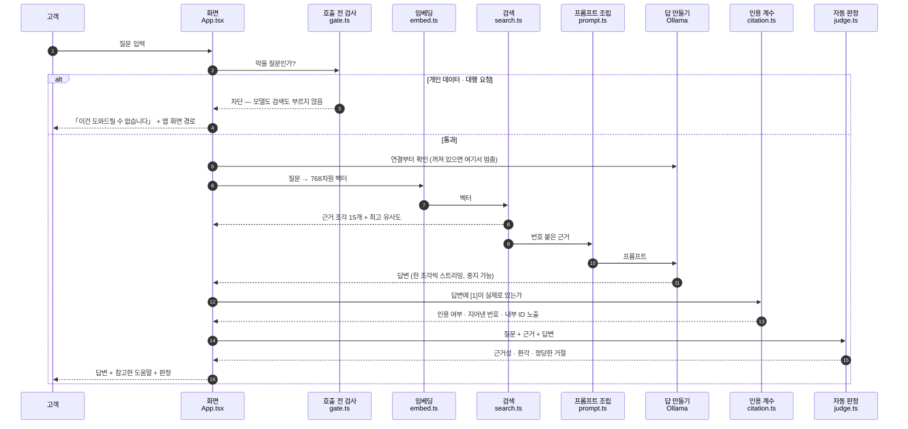

# 구조와 각 파일의 역할

[README](../README.md)의 3층 그림을 파일 단위로 펼친 것입니다. **어느 파일이 무엇을 책임지는지**, 그리고 **왜 그 자리에 있는지**를 함께 적습니다.

---

## 1. 질문 하나가 지나는 길

질문을 보내면 여섯 관문을 **순서대로** 지납니다. 앞의 관문이 막으면 뒤는 돌지 않습니다.



**연결 확인이 임베딩보다 앞에 있는 이유**: 이걸 건너뛰면 고객이 195MB 를 받고 임베딩까지 마친 뒤에야 "Ollama 가 꺼져 있습니다"를 봅니다. 한참 기다린 끝에 실패하게 두지 않습니다.

**인용 계수(`citation.ts`)가 판정(`judge.ts`)과 별개인 이유**: 3절을 보세요.

---

## 2. 파일별 역할

### ② 쓸 때 도는 층 — `app/src/`

| 파일 | 한 줄 역할 | 왜 이 자리에 있는가 |
|---|---|---|
| `main.tsx` | React 를 붙인다 | 10줄. 그 외 아무것도 하지 않는다 |
| `App.tsx` | 화면 전체 + 아래 lib 들을 순서대로 부른다 | **판단은 하지 않는다.** 판단은 전부 `lib/` 안에 있다 |
| `lib/gate.ts` | 개인정보·대행 요청을 **모델 부르기 전에** 막는다 | 프롬프트에 적었을 때 3회 중 1회 새어 나갔다. 셀 수 있는 것만 맡는다 |
| `lib/embed.ts` | 질문을 768차원 벡터로. 캐시·진행률·**중복 실행 방지** | 195MB 다운로드 경험을 지키고, 겹쳐 도는 호출을 여기서 줄 세운다 |
| `lib/search.ts` | 코사인 상위 10 + BM25 상위 5, 약한 근거 판단 | 뜻이 비슷한 것과 낱말이 겹치는 것을 둘 다 잡는다 |
| `lib/prompt.ts` | 정해진 순서로 프롬프트를 조립한다 | 순서를 고정해야 무엇을 바꿔서 무엇이 달라졌는지 읽을 수 있다 |
| `lib/ollama.ts` | 연결 확인 · 스트리밍 · 취소 | 페이지가 고장 난 것과 Ollama 가 꺼진 것을 구별해 안내한다 |
| `lib/judge.ts` | 답변을 다시 읽는 두 번째 시선 | **독립 심사가 아니다** — 답을 만든 것과 같은 2B 모델이다 |
| `lib/negation.ts` | 근거 원문의 "~하지 않는다" 문장을 짚는다 | 답이 부정을 뒤집는 것을 **못 고쳐서**, 대조할 자리를 알려 준다 |
| `lib/citation.ts` | 답변이 근거를 실제로 가리켰는지 **프로그램이 센다** | 3절 |
| `lib/usage-steps.ts` | 사용 조건 문장의 원본 | 화면과 README 가 어긋나지 않도록 한곳에서 관리 |

### ① 미리 만들어 두는 층 — `scripts/`

| 파일 | 한 줄 역할 | 왜 이 자리에 있는가 |
|---|---|---|
| `build_chunks.py` | 공개 문서에서 **연속 구간을 그대로 오려내** 청크로 | 요약하면 고객이 출처를 열었을 때 그 문장이 없다 |
| `embed-docs-browser-path.mjs` | 청크를 768차원 벡터로 → 정적 JSON | 이름의 `browser-path` 가 핵심 → 4절 |

**`build_chunks.py` 는 매번 원문을 새로 받아 대조합니다.** 오려낸 문장이 원문에 아직 있는지 확인하고, 없으면 멈춥니다. `dev-bot` 에서 실제로 이 검사가 깨진 청크 3개를 잡아냈습니다 — 링크는 그대로 열렸기 때문에 눈으로는 못 찾았을 문제였습니다.

### 검사·실험 스크립트 — `scripts/check_*` · `run_*`

이 저장소의 특징입니다. **눈으로 맞추지 않고 스크립트가 대조합니다.**

| 파일 | 무엇을 검사하는가 |
|---|---|
| `check_gate.ts` | 통과해야 할 질문과 막아야 할 질문 — **잘못 막는 것이 가장 위험하다** |
| `check_hybrid.ts` | 검색이 기대한 조각을 올리는가 (**`dev-bot` 만**) |
| `check_judge.ts` | 판정이 JSON 형식을 지키는가 (**`dev-bot` 만**) |
| `check_negation_detect.ts` | 부정문 탐지가 원문을 제대로 짚는가 (**`dev-bot` 만**) |
| `check_usage_steps.ts` | 화면 문구와 README 문구가 **글자 그대로** 같은가 |
| `check_feedback.ts` | 내려받은 피드백 파일이 읽히는가 |
| `check_citation.ts` | 인용 계수가 맞는가 |

> **세 개는 `dev-bot` 에만 있습니다.** `support-bot` 에도 같은 파일이 복사돼 있었는데, dev-bot 의 벡터스토어 파일명(`already-got-it-docs.json`)을 그대로 읽어 **한 번도 돌지 않았습니다.** 문서가 안내한 적도 없습니다. 돌지 않는 검사가 남아 있으면 **없는 검증이 있는 것처럼 보이므로** 지웠습니다.
| `show_prompt.ts` | 모델에게 **실제로 가는** 프롬프트를 그대로 찍는다 |
| `run_rubric.ts` · `summarize_rubric.ts` | 평가 세트를 3회씩 돌려 표로 정리 |
| `collect_failures.ts` | 실패한 답을 **어느 단계가 원인인지**로 나눈다 |

### 자료 — `data/` · `app/public/`

| 위치 | 무엇 |
|---|---|
| `data/chunks.json` | 청크 원본 (벡터 없음) — 사람이 읽고 검토하는 것 |
| `app/public/*-docs.json` | 청크 + 벡터 — 브라우저가 받아 가는 것 |
| `app/public/parity-anchor.json` | 임베딩 대조 기준점 (4절) |
| `data/eval-queries.json` | 평가 세트 |
| `data/rubric/` | 실험 세팅별 답변 원문 전체 |
| `data/observed-failures.json` | 실제로 써 보다 찾은 실패 원자료 |

---

## 3. 왜 인용 세기를 판정 모델에게서 빼앗았나

`dev-bot` 은 "답변에 출처 표시가 있는가"를 **판정 모델에게 물었습니다.** 그리고 자주 틀렸습니다 — 측정한 실패 108건 중 **42건이 이 판정의 실패**입니다.

두 번 고쳐 보고 두 번 다 되돌렸습니다.

| 시도 | 무엇을 바꿨나 | 결과 |
|---|---|---|
| 생성 온도를 0으로 | 흔들림을 줄이려고 | 판정 정확도 0.74 → **0.48** |
| 출처 표기를 `[AG-004]` 로 통일 | 판정이 못 알아본다고 봐서 | 표기는 100% 맞았는데 정확도 0.74 → **0.59** |

어느 쪽으로 건드려도 나빠졌습니다. 남는 결론은 하나입니다 — **문제는 문구가 아니라, 답을 만든 것과 같은 작은 모델에게 판정을 맡긴 구조 자체입니다.**

`support-bot` 은 이 일을 프로그램에게 줍니다.

| 세는 것 | 방법 | 누가 |
|---|---|---|
| 인용했는가 | 본문에서 `[숫자]`를 찾는다 | 프로그램 |
| 지어낸 인용인가 | 근거가 5개인데 `[7]`이 있는가 | 프로그램 |
| 내부 ID가 새어 나왔는가 | 본문에 `HELP-` 가 있는가 | 프로그램 |
| 절차형으로 답했는가 | 번호 목록과 화면 이름이 있는가 | 프로그램 |
| 답이 근거에서 나왔는가 | 뜻을 읽어야 한다 | 판정 모델 |
| 환각이 있는가 | 뜻을 읽어야 한다 | 판정 모델 |
| 정당한 거절인가 | 뜻을 읽어야 한다 | 판정 모델 |

**글자를 찾으면 끝나는 일을 모델에게 물어볼 이유가 없었습니다.**

---

## 4. 왜 임베딩 스크립트 이름에 `browser-path` 가 붙었나

문서 벡터는 **Node 가 미리** 만들고, 질문 벡터는 **브라우저가 그때그때** 만듭니다. 둘이 다른 방식으로 만들어지면 숫자는 나오지만 **비교할 자리를 잃습니다** — 서로 다른 공간에 놓인 화살표의 각도를 재는 셈이 됩니다.

그래서 양쪽을 강제로 맞췄습니다.

| 맞춘 것 | 값 |
|---|---|
| 모델 파일 | `model_no_gather_q4.onnx` (기본 q4/q8 경로는 WASM 에서 실패한다) |
| 실행 방식 | ONNX Runtime `wasm` |
| 풀링 | attention mask 가 가리키는 토큰만 평균 |
| 정규화 | L2 (정규화하면 내적이 곧 코사인 유사도가 된다) |
| 접두어 | 문서 `title: none \| text:` / 질문 `task: search result \| query:` |

같은 문장을 양쪽에서 만들어 견줘 **1.000000** 을 확인했습니다. 화면의 「임베딩 대조」 버튼이 언제든 다시 잽니다 — 기준점은 `app/public/parity-anchor.json` 에 Node 가 넣어 둔 벡터입니다.

**접두어 한 줄이 실제로 기능을 살렸습니다.** 붙이기 전에는 자료 안 질문과 밖 질문의 점수가 겹쳐서(틈 −0.005) 약한 근거 경고가 한 번도 켜지지 않았습니다. 붙인 뒤 틈이 +0.016 이 되어 처음 켜졌습니다.

> ⚠️ 그 틈이 **0.016 으로 좁습니다.** 질문 열몇 개로 잰 값이라 새 질문이 오면 다시 겹칠 수 있습니다. "지금 이 자료와 이 질문들에서 작동한다"는 뜻이지 보편적인 값이 아닙니다.

---

## 5. 배포 구조

GitHub Pages 하나에 두 앱을 담습니다. Vite 의 `base: './'` 덕분에 하위 경로에서도 자산을 찾습니다.

```
gh-pages 브랜치
├── (support-bot 빌드)   → https://hey-byeunya.github.io/already-got-it-guide-bot/
└── dev/ (dev-bot 빌드)  → https://hey-byeunya.github.io/already-got-it-guide-bot/dev/
```

배포 주소에서 **무엇이 되고 무엇이 안 되는지**는 [README](../README.md#실행)와 [support-bot PRD 8-3](../support-bot/PRD.md)에 나눠 적어 두었습니다. 로컬에서 확인한 것을 배포에서 확인한 것처럼 적지 않습니다.
